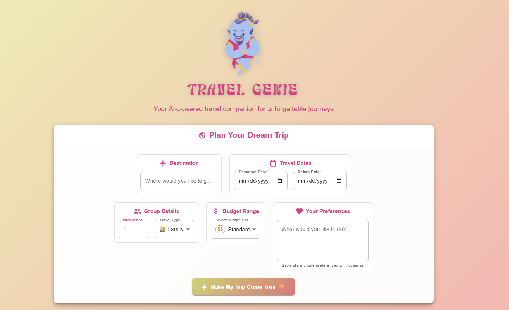
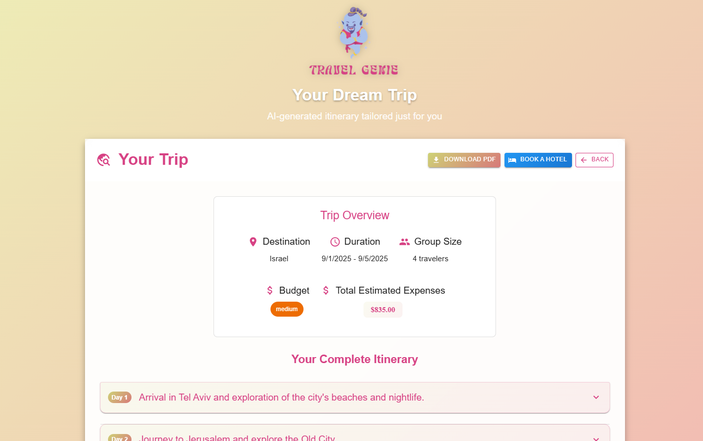

# 🧞 TravelGenie – AI Trip Planner

**TravelGenie** הוא פרויקט Full-Stack שמאפשר למשתמש לתכנן טיול חכם בצורה פשוטה ונוחה.  
המערכת מחוברת ל־**Gemini 2.0 Flash** כדי לייצר מסלול טיול מותאם אישית, מאפשרת הפקה של PDF עם **QuestPDF**, וגם מספקת קישור ל־**Booking.com** לסגירת מלון ליעד שנבחר.

---

## ✨ Features

- 🗺️ **AI Itinerary** – הפקת מסלול טיול מותאם אישית לפי יעד, תאריכים וסוג קבוצה.  
- 🎨 **Modern UI** – פרונט נבנה עם React (JavaScript) ו־Material UI.  
- 📄 **PDF Export** – יצירת PDF אוטומטי עם המסלול בעזרת QuestPDF.  
- 🏨 **Booking.com Link** – קישור ישיר להזמנת מלון לפי היעד והתאריכים.  
- ⚡ **Simple Architecture** – אין SQL, אין JWT, אין ניהול משתמשים — פרויקט ממוקד וקליל.  

---

## 🛠️ Tech Stack

- **Frontend:** React + JavaScript + Material UI  
- **Backend:** .NET 6 (C# Web API)  
- **AI:** Gemini 2.0 Flash (Google Generative Language API)  
- **PDF:** [QuestPDF](https://www.questpdf.com/)  

---

## 📷 Screenshots

  
  

